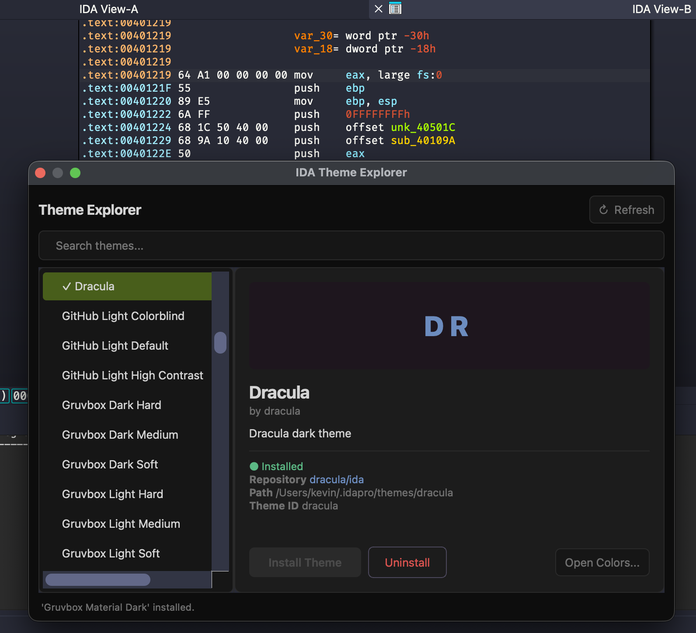

# IDA Theme Explorer

<p align="center">

</p>

Install **100+ community themes for IDA Pro** in two clicks.

Theme Explorer lets you browse and install themes without manually copying CSS files.

Includes popular themes such as **Dracula, Monokai, Solarized, Gruvbox, Catppuccin, Tokyo Night, One Dark**, and many others collected from community repositories.

## Features

* browse **100+ community themes**
* install themes directly from GitHub
* uninstall themes
* search themes
* open IDA **Options → Colors**
* lightweight UI
* keyboard shortcut (Ctrl + Alt + T)

<p align="center">

</p>

## Installation

Recommended with **HCLI**:

```bash
hcli plugin install ida-theme-explorer
```

Manual installation:

Clone the repo and copy it to your IDA plugins directory:

```
~/.idapro/plugins/
```

## Requirements

```
IDA Pro >= 7.3
```

Themes rely on the CSS-based theming system introduced in IDA 7.3.

## Themes

Themes are collected from community repositories.

Special thanks to @can1357 for generating 80+ IDA themes from VSCode themes.

## Missing a theme?

Open an issue.

If the repository contains a `theme.css`, it can probably be added.

## License

MIT
