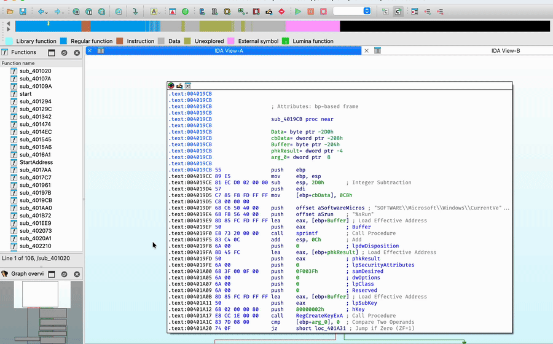

# IDA Theme Explorer


Install **100+ community themes for IDA Pro** in two clicks.

Theme Explorer lets you browse and install themes without manually copying CSS files.

Includes popular themes such as **Dracula, Monokai, Solarized, Gruvbox, Catppuccin, Tokyo Night, One Dark**, and many others collected from community repositories.

## Features

* browse **100+ community themes**
* install themes directly from GitHub
* search themes
* uninstall themes
* lightweight UI
* open IDA **Options → Colors**
* keyboard shortcut (Ctrl + Alt + T)



## Installation

Recommended with **HCLI**:

```bash
hcli plugin install ida-theme-explorer
```

Manual installation:

Clone the repo and copy it to your IDA plugins directory:

```
~/.idapro/plugins/
```

## Requirements

```
IDA Pro >= 9.0
```

Themes rely on the CSS-based theming system introduced in IDA 7.3.

## Themes

Themes are collected from community repositories.

Special thanks to [can1357/IdaThemer](https://github.com/can1357/IdaThemer) for creating a tool that generates IDA themes from VSCode themes.

Other community themes come from repositories such as:

- dracula/ida  
- pr701/dp701  
- ioncodes/long_night  
- blue-devil/IDA-Pro-Solarized-Theme  
- rpigu-i/ida-theme-pihunter  
- iArtorias/vslight-ida

## Missing a theme?

Open an issue.

If the repository contains a `theme.css`, it can probably be added.

## What this plugin actually does

Nothing magical.

It just:

- indexes community themes
- downloads them from their original GitHub repositories
- installs them into `~/.idapro/themes/`

Then you enable them via: **Options → Colors**

## License

MIT
